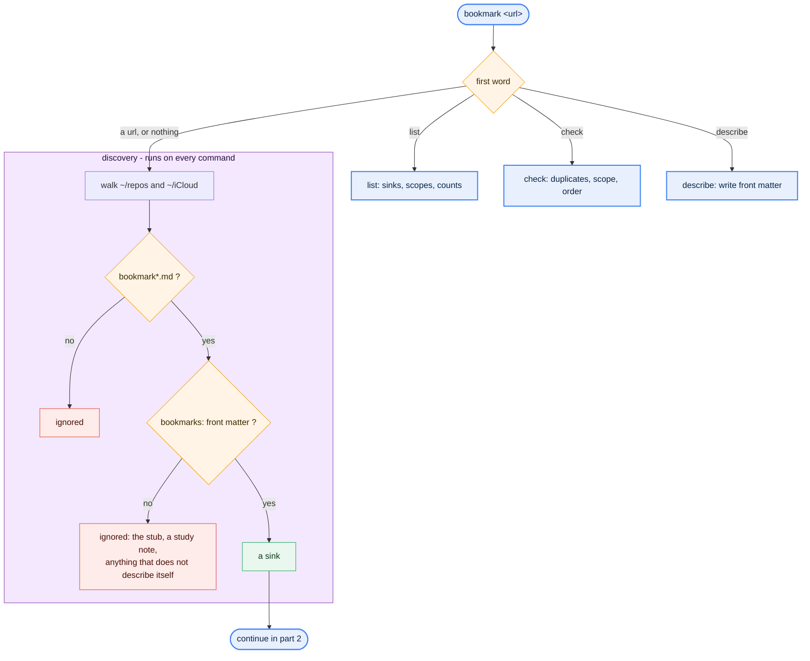
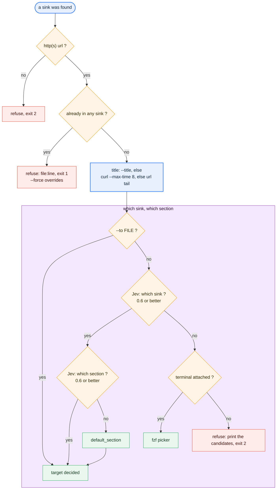
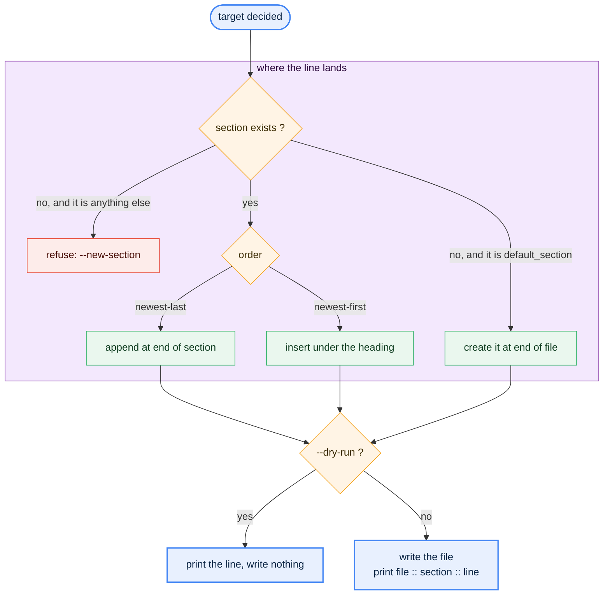

# Bookmarks

`script/bookmark` is the one writer for every bookmark file on this machine. It
replaced the old three-line `sort ~/bookmarks.txt | fzf | xargs open` launcher,
which had been broken since `~/bookmarks.txt` went away, and the duplicate
`bookmark3`.

## The protocol

A file is a **sink** only if it describes itself: YAML front matter with a
`bookmarks:` key. A file without one is invisible to `add`, which is how the
redirect stub `~/repos/personal/BOOKMARKS.md` and the study note
`~/repos/work/deck/verification/peakrdl/bookmark.md` were sorted out without a
hardcoded list anywhere.

```markdown
---
bookmarks:
  scope: work and technical links - agents, FPGA, electronics, AI, reading
  default_section: Read Later
  order: newest-last
---
```

- `scope` is the routing sentence. Jev reads it and nothing else of the file, so
  it should say what belongs there rather than what the file is called.
- `sections` is deliberately absent: the `##` headings already are the sections,
  and a copy in the metadata would drift from them.
- `default_section` is created at the end of the file when missing. Any other
  missing section needs `--new-section`, because inventing a category is a
  judgement call, not a deterministic write.
- `order` is `newest-last` (append at the end of the section) or `newest-first`
  (insert under the heading).

Other front matter keys are preserved byte for byte: the published page
`~/repos/raveenkumar.xyz/raveenkumar.xyz/content/library/Bookmarks.md` keeps its
`title`, `description`, `tags` and `date` when the block is written.

## Flow

Three diagrams, drawn from the same mermaid source that renders in any markdown
viewer. Re-render them with the offline mermaid-cli that is already in the npx
cache:

```
node ~/.npm/_npx/668c188756b835f3/node_modules/@mermaid-js/mermaid-cli/src/cli.js \
  -i FILE.mmd -o FILE.svg -p /Users/raveen_kumar_personal/tmp/mmdc_puppeteer.json -b "#f7f8fa"
```

### 1. Which command runs, and what counts as a sink



### 2. The checks and the routing



### 3. Placement and the write



## Commands

| Command | What it does |
|---|---|
| `bookmark URL` | Add it. Routing below |
| `bookmark` | fzf over every sink and section, opens the pick |
| `bookmark list` | The sinks, their scope, link and section counts (`--json` for scripts) |
| `bookmark check` | Validate the protocol across every sink; exit 1 on findings |
| `bookmark describe FILE --scope '...'` | Write or update the front matter |

Flags for `add`: `--to FILE`, `--section NAME`, `--title TEXT`,
`--new-section`, `--force`, `--no-jev`, `--dry-run`, `--json`.

## Routing

1. `--to` (with `--section`) wins outright.
2. Otherwise Jev, in two choices: the sink, then the section inside it. Jev sees
   one sink's scope and section names at a time - accuracy falls with a large
   state, and a single 24-option choice is a coin toss.
3. Only at 0.6 confidence or better. Below that: fzf when a terminal is
   attached, otherwise it stops and prints the candidates.
4. The same routing applies whether the command comes from a shell or from an
   agent; an agent has no terminal, so its two paths are `--to` and Jev.

A live example, run as a dry run:

```
bookmark https://www.meditation.com/ --dry-run
dry run: would add to ~/iCloud/notes/bookmarks.md under 'Meditation':
  - [Meditation.com: The place to Discover the Impact of Meditation](https://www.meditation.com/)
```

## Duplicates

`add` refuses a URL that already sits in any sink, printing the file and line,
and `--force` overrides. The comparison ignores scheme, `www.` and a trailing
slash, so `http://example.com/x/` and `https://www.example.com/x` are one link.

## Tests

```
python3 -m pytest tests/test_bookmark.py
```

15 cases, offline: Jev is never called (the tests pass `--no-jev`), the sinks
are a temporary tree via `BOOKMARK_ROOTS`. They cover discovery by front matter,
the duplicate refusal and `--force`, both orderings, default-section creation,
the refusal of an invented section, `--dry-run` writing nothing, and that
`describe` leaves other front matter keys untouched.

## Known ceilings

- `order` is per file, not per section, so `## Reading Log` in
  `~/repos/work/bookmarks.md` appends at the end despite reading newest first.
- A link added to the published page is published. It is the only sink whose
  content is public.
- Jev never routes to a sink whose `scope` is empty; `bookmark check` flags that
  as a finding.
